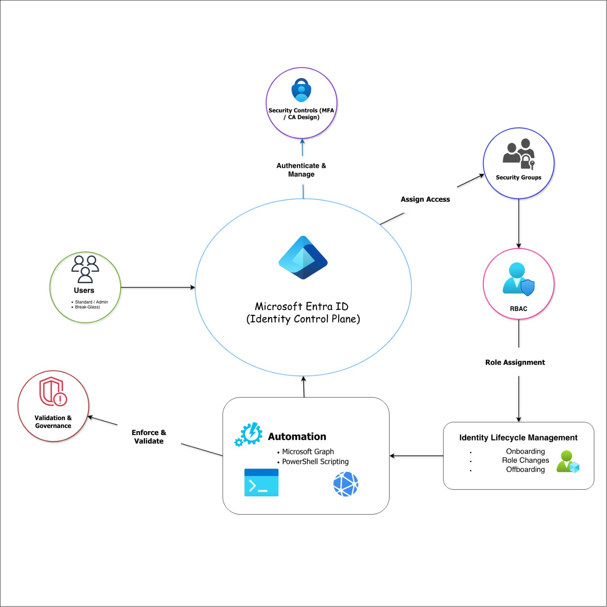

# Azure Identity & Endpoint Governance Lab

*A cloud-based identity governance implementation focused on secure access control, automation, and real-world administrative practices.*

---

## Overview

This project demonstrates the design and implementation of a cloud-based identity governance solution using Microsoft Entra ID and PowerShell automation.

The focus was on building a structured, secure, and scalable identity management system that reflects real-world administrative practices, including group-based access control, least-privilege role assignment, and automated user lifecycle management.

---

## Business Scenario

This project was modeled after a small-to-mid size organization (~75 users), similar to environments I have worked in.

The organization faced common challenges:
- Inconsistent access control across users  
- Manual onboarding and offboarding processes  
- Lack of centralized identity governance  
- Limited enforcement of security controls  

The goal was to design a system that improves:
- Access consistency  
- Security posture  
- Administrative efficiency  

---

## Architecture Summary

The solution is centered around Microsoft Entra ID as the identity provider and control plane.

### Core Components:
- **Microsoft Entra ID** (Identity Provider)  
- **Security Groups** (Access Control Model)  
- **Administrative Roles (RBAC)** (Least Privilege)  
- **MFA Baseline** (Security Defaults)  
- **PowerShell Automation (Microsoft Graph)**  
- **Validation via Graph Queries and Entra Portal**  

---

This diagram illustrates how Microsoft Entra ID functions as the identity control plane, governing authentication, access assignment, role management, lifecycle operations, automation, and validation within the environment.

## Identity & Access Model

### Account Types:
- **Standard Users** – Day-to-day access  
- **Admin Accounts** – Privileged operations (separate from user accounts)  
- **Break-Glass Accounts** – Emergency access  

### Access Strategy:
- Access is assigned via **security groups rather than directly to users**, enforcing consistency and reducing administrative overhead  

- Groups are organized by:
  - Department (Finance, HR, IT)  
  - Role-based access  
  - Privileged access tracking  

### RBAC Implementation:
- Global Administrator (restricted use)  
- User Administrator  
- Groups Administrator  

---

## Security Baseline

- MFA enabled using Security Defaults  
- Admin accounts separated from standard users  
- Break-glass accounts maintained for recovery scenarios  

### Conditional Access (Design)

The following policies were designed but not implemented due to licensing constraints:
- Require MFA for all users  
- Require MFA for admin accounts  
- Block legacy authentication  
- Exclude break-glass accounts  

> Conditional Access policies were designed but not fully implemented due to Entra ID licensing limitations. The configuration reflects production intent.

---

## Automation

Automation was implemented using Microsoft Graph PowerShell.

### Onboarding Script (`New-CompanyUser.ps1`)
- Creates new user accounts  
- Applies naming conventions  
- Assigns:
  - Department security group  
  - Baseline access group (SG-M365-Users)  

### Offboarding Script (`Disable-CompanyUser.ps1`)
- Disables user account  
- Removes all group memberships  
- Preserves account for audit and retention purposes  

These scripts establish a repeatable identity lifecycle process, reducing manual intervention and improving operational consistency.

---

## Validation & Testing

All configurations and automation workflows were validated using:

### PowerShell:
- `Get-MgUser`  
- `Get-MgUserMemberOf`  

### Entra Portal:
- User existence  
- Group membership  
- Account status (enabled/disabled)  

This ensured that identity lifecycle actions behaved as expected across both programmatic and administrative interfaces.

---

## Operational Impact

- Reduced manual user provisioning effort  
- Standardized access assignment across departments  
- Improved security posture through MFA and role separation  
- Implemented repeatable and scalable identity workflows  

---

## Limitations & Considerations

- Conditional Access was not implemented due to licensing limitations  
- Role assignment to groups (Privileged Access Groups) was not available  
- Azure free tier environment used for implementation  

### Production Improvements:
- Enable Conditional Access policies  
- Use role-assignable security groups  
- Integrate Microsoft Intune for endpoint compliance  

---

## Technologies Used

- Microsoft Azure  
- Microsoft Entra ID  
- Microsoft Graph PowerShell  
- PowerShell scripting  

---

## Screenshots

*(To be added)*

Suggested:
- Onboarding script execution  
- Offboarding script execution  
- User in Entra ID  
- Group membership validation  
- Disabled user account  

---

## Project Structure

azure-identity-endpoint-governance/
│

├── README.md

├── docs/

├── scripts/

├── evidence/

└── diagrams/

---

## Documentation

Detailed project documentation is available in the `docs` folder.

1. [Architecture Overview](./docs/architecture-overview.md)
2. [Identity and Access Design](./docs/identity-and-access-design.md)
3. [Security Baseline](./docs/security-baseline.md)
4. [Automation Design](./docs/automation-design.md)
5. [Constraints](./docs/constraints.md)
6. [Implementation Summary](./docs/implementation-summary.md)

---

## Author

**Emmanuel Johnson**  
Technical Support Specialist → Aspiring Systems / Cloud Administrator  
https://www.linkedin.com/in/emmanuel-a-johnson  

This project reflects my transition from IT support into systems administration and cloud identity management, with a focus on building real-world, operationally relevant solutions.
